# Find-A-Pint
## Overview

With all the confusion surrounding the lockdown in England and what people were or were not allowed to do. Our initial idea was to create a website focused on the Public House industry showing which places were open, which places had outdoor seating, where one could get take-away drinks from etc. This quickly developed into something that could be used both during this current confusion and post lockdown, so we tried to include as much information about the sites as possible. We also wanted to make it a more social website than just being able to look up places to drink. We not only wanted friends to be able to communicate and coordinate places to meet and have a drink but also for Pubs to be able to give out information/offers etc to their 'subscribers'. For this we implemented a friend requesting/adding system that works hand in hand with the map in order to give the best usability on finding a place. And a subscribing/emailing system for landlords to be able to communicate with their customers and keep them up to date with the lastest news/offers.


## Brief

* Work in a team, using **git to code collaboratively**.
* **Build a full-stack application** by making your own backend and your own front-end
* **Use an Express API** to serve your data from a Mongo database
* **Consume your API with a separate front-end** built with React
* **Be a complete product** which most likely means multiple relationships and CRUD functionality for at least a couple of models
* **Implement thoughtful user stories/wireframes** that are significant enough to help you know which features are core MVP and which you can cut
* **Have a visually impressive design**
* **Be deployed online** so it's publicly accessible.


### Wireframe 

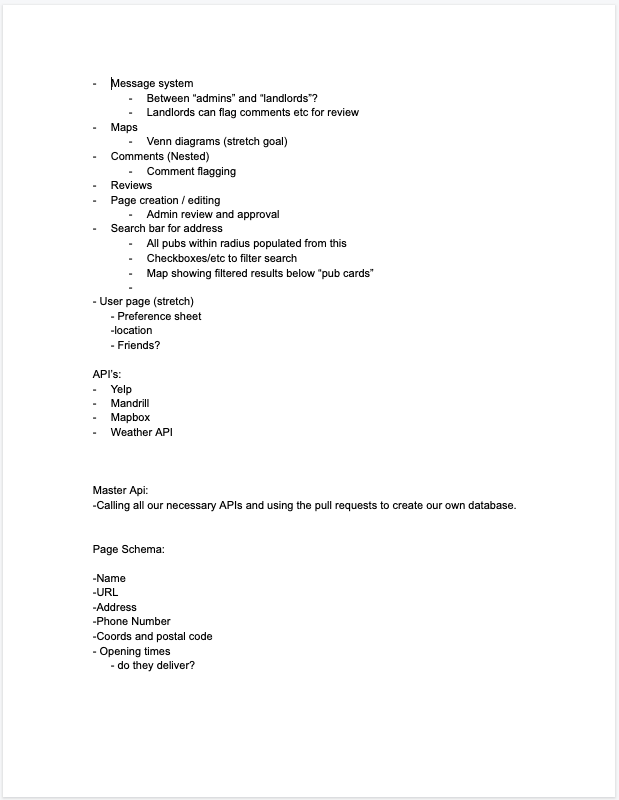
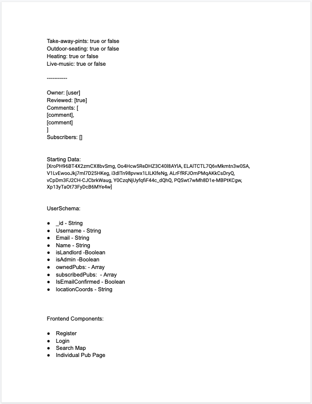
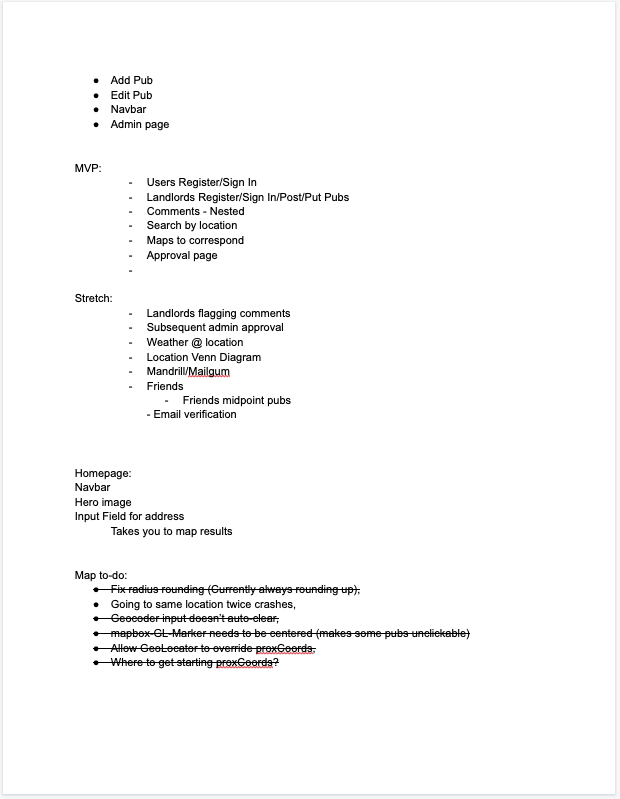

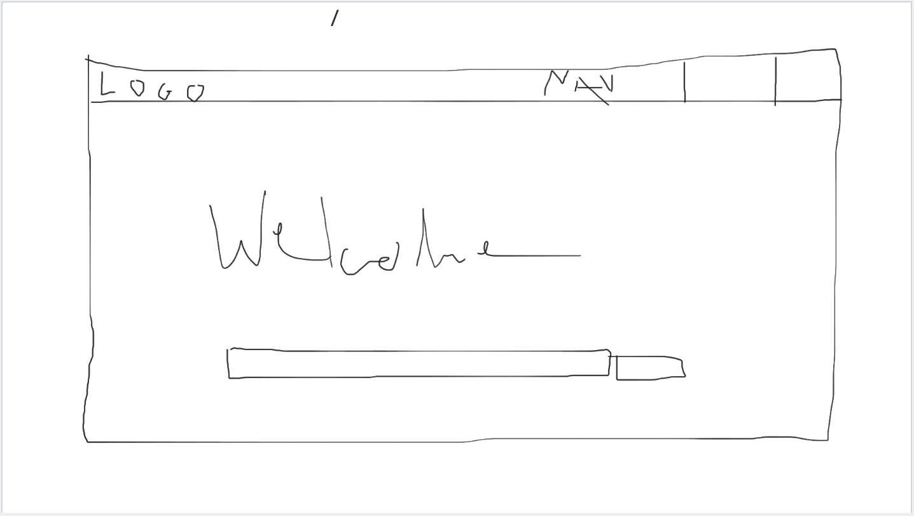
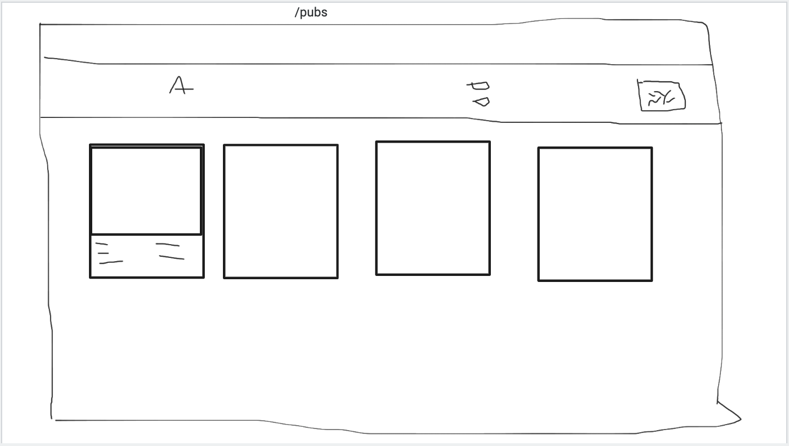
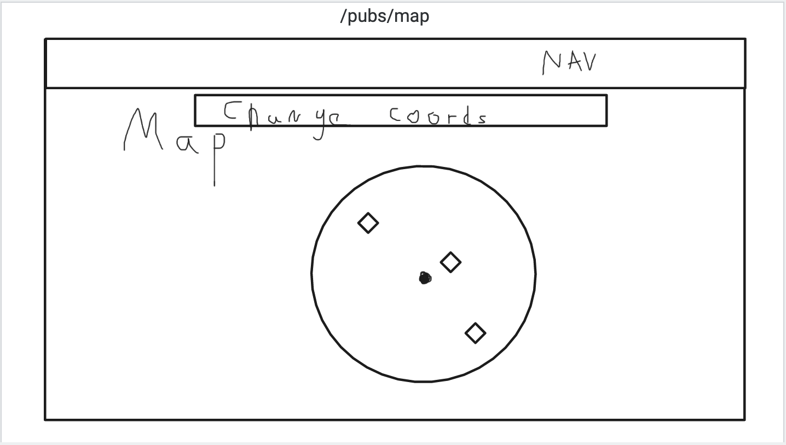
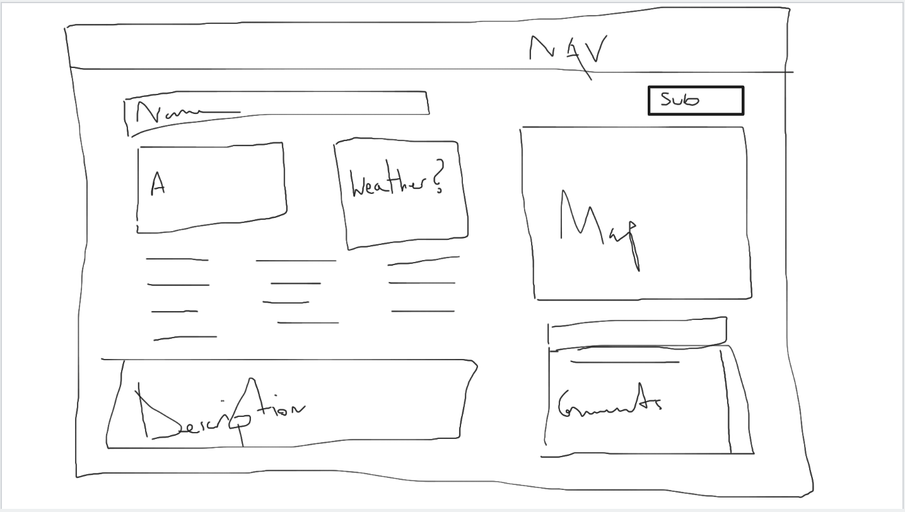


 
Challenges/victories
### The Map:

Displaying an interactive map was simple using the mapbox library, but we wanted our map to be a little more complex to fit our user's needs. Our final vision for the map was a radius-based filtering system, one where you could select the location of a friend and have a venn diagram display all the pubs you share in a radius of x kilometers. Adding all the different map markers was as simple as fetching their location using our own API and a reverse geocoding library.

        {filteredPubList.map((pub, index) => {
          return <Marker latitude={pub.coordinates.latitude} longitude={pub.coordinates.longitude} key={index} offsetLeft={-25} offsetTop={-25}>
            <div>
              <button className='marker-btn' onClick={(e) => {
                e.preventDefault()
                setPopup(true)
                setSelectedPub(pub)
              }}>
                
              </button>
            </div>
          </Marker>
        })}
The next step was to make each pub icon display a pop up with it's respective information on click.

       {selectedPub && showPopup ? (
          <Popup
            latitude={selectedPub.coordinates.latitude}
            longitude={selectedPub.coordinates.longitude}
            offsetTop={-30}
            onClose={() => setPopup(false)}
            closeOnClick={false} >
            <div>
              <Link to={`${selectedPub._id}`}>
                <h2 style={{ fontWeight: '900', textDecoration: 'underline' }}>{selectedPub.name}</h2>
                <p>{selectedPub.address.address1}</p>
                <p>{measure(proxCoords[1], proxCoords[0], selectedPub.coordinates.latitude, selectedPub.coordinates.longitude).toString().split('.')[0]}km,  {measure(proxCoords[1], proxCoords[0], selectedPub.coordinates.latitude, selectedPub.coordinates.longitude).toString().split('.')[1].substring(0, 3)}m</p>
              </Link>
            </div>
          </Popup>
        ) : null}
We now had an interactive map that could display all of our pubs, and their respective information. Displaying a proximity radius presented two challenges, drawing on the map, and the math behind the display. 

#### The Math
The radius filter would be implemented by calculating the distance between the coordinates of the user, and the coordinates of the pub, if the distance is under x kilometers, display the pub marker. This was done by implementing a function that could calculate the distance between two coordinates, and running that function for each pub.

Measure Function:

		  function measure(lat1, lon1, lat2, lon2) {
		    var R = 6378.137 // Radius of earth in KM
		    var dLat = lat2 * Math.PI / 180 - lat1 * Math.PI / 180
		    var dLon = lon2 * Math.PI / 180 - lon1 * Math.PI / 180
		    var a = Math.sin(dLat / 2) * Math.sin(dLat / 2) +
		      Math.cos(lat1 * Math.PI / 180) * Math.cos(lat2 * Math.PI / 180) *
		      Math.sin(dLon / 2) * Math.sin(dLon / 2)
		    var c = 2 * Math.atan2(Math.sqrt(a), Math.sqrt(1 - a))
		    var d = R * c
		    return d // km float
		  }
	  
Filtering our pubs using that function:

        setFilteredPubList(pubList.filter(elem => {
          if (Number(measure(proxCoords[1], proxCoords[0], elem.coordinates.latitude, elem.coordinates.longitude)) < radius) {
            return true
          }
        
### Drawing on the map

* This proved to be the biggest challenge as mapbox would not let us draw custom shapes on the map besides the built in markers. After a lot of researching and alternative testing, I came across the library Uber uses to draw routes on the GPS for their drivers. I thought I could repurpose that feature to draw over buildings and create a custom shape by feeding the GPS library multiple different coordinates. This worked wonderfully and found a library that could calculate all the coordinates needed for a circle of x Kilometers. The circle would really be a collection of 150 straight lines, but the effect worked.

        <Source id='CircleRadius1' type='geojson' data={circ1} />
        {showRadius ? (
          <Layer
            id='CircleRadius1'
            type='line'
            source='CircleRadius1'
            layout={{
              'line-join': 'round',
              'line-cap': 'round'
            }}
            paint={{
              'line-color': '#94ccdc',
              'line-width': 4
            }}
          />

Everything worked perfectly, and was responsive to any location, and distance fed.


## Comments / Nested Comments & Flags
We wanted to allow users to add comments on pubs and for pubs/other users to be able to reply to these comments. However endlessly nesting comments seemed like overkill given what we 'expected' the comments to be. In order to do this we passed a 'replySchema' through the 'commentSchema' that would allow for multiple replies on the same comment. And then passed the 'commentSchema' through the pub schema to associate them with a specific place. 

```
const replySchema = new mongoose.Schema({
  text: { type: String, required: true },
  flagged: { type: Boolean },
  user: { type: mongoose.Schema.ObjectId, ref: 'Users', required: true }
}, {
  timestamps: true
})

const commentSchema = new mongoose.Schema({
  text: { type: String, required: true },
  flagged: { type: Boolean },
  user: { type: mongoose.Schema.ObjectId, ref: 'Users', required: true },
  replies: [ replySchema ]
}, {
  timestamps: true
})
```

As we expected that not all comments made would be positive ones, we wanted to allow landlords to be able to contest comments that were left about their pub. For this we added a flagging system. If a landlord is unhappy with a comment they can click the little flag (which turns red). This comment then appears in the 'Admin' page and can be reviewed by an admin and kept or deleted accordingly.

```
{isLandlord(user) && <Icon
 onClick={() => handleFlag(comment._id)}
 path={mdiFlagVariant}
 size={1}
 color={comment.flagged === true ? 'red' : 'grey'}
/>}
```

A feature we wanted to include with the flags was that landlords could also flag replies to comments. We needed then to be able to flag the comment itself if one of the replies is flagged and then to undo the same if the reply is deemed suitable by the admin. For this we had to build a logic tree that interated both with the comment and the reply on the backend depending on what needed to happen.

```
  function handleFlag(replyId) {
    axios.get(`/api/pub/${id}/comments/${commentId}/reply/${replyId}`)
      .then(resp => {
        if (resp.data.flagged === false) {
          axios.put(`/api/pub/${id}/comments/${commentId}`, { flagged: true }, {
            headers: { Authorization: `Bearer ${token}` }
          })
            .then(resp => {
              axios.put(`/api/pub/${id}/comments/${commentId}/reply/${replyId}`, { flagged: true }, {
                headers: { Authorization: `Bearer ${token}` }
              })
                .then(resp => {
                  updateComment(resp.data)
                  console.log(resp.data)
                })
            })
        } else if (resp.data.flagged === true) {
          const flaggedReplies = comment.replies.filter(reply => {
            if (reply.flagged === true) {
              console.log(reply)
              return reply
            }
          })
          if (flaggedReplies.length - 1 === 0) {
            axios.put(`/api/pub/${id}/comments/${commentId}`, { flagged: false }, {
              headers: { Authorization: `Bearer ${token}` }
            })
              .then(resp => {
                axios.put(`/api/pub/${id}/comments/${commentId}/reply/${replyId}`, { flagged: false }, {
                  headers: { Authorization: `Bearer ${token}` }
                })
                  .then(resp => {
                    updateComment(resp.data)
                    console.log(resp.data)
                  })
              })
          } else {
            axios.put(`/api/pub/${id}/comments/${commentId}/reply/${replyId}`, { flagged: false }, {
              headers: { Authorization: `Bearer ${token}` }
            })
              .then(resp => {
                updateComment(resp.data)
              })
          }
        }
      })
  }
```


Known bugs
Potential future features
Images Used


# Challenges/Victories - Lee
## Friends System 
### Challenges: 
When we started creating the system for adding friends on the website we expected it to be a fairly straightforward feature. 

The feature works by pushing in the potential friend’s ID into the users friend field and vice versa. However pushing this data into the usermodel caused an issue where the password would re-encrypt, meaning after a single friend request no users could log back into the site. 


To solve this issue we had to isolate where the change was occurring which eventually led to us cross comparing the initial encryption compared to the encryption after the friend request was sent. 

Once we had isolated where the problem was coming from it was an easy fix, we had to change the encryption to a on is modified as shown below: 


	schema
	 .pre('save', function hashPassword(next) {
	   if (this.isModified('password')) {
	     this.password = bcrypt.hashSync(this.password, bcrypt.genSaltSync())
	   }
	   next()
	 })


Victories: 
The friend system once the challenges had been solved was a victory in itself. It allowed us to pull relevant data from two users who were connected. To make the most of this we created a function which took that data and mapped how far away from each other they were. 

To get this to work we had to write a fairly lengthy solution to resolve all the promises the response from the API would give us. 


       axios.get(`/api/users/${id}/requests`)
         .then(resp => {
           const Frienddata = resp.data
           updateFriends(Frienddata)
           if (Frienddata.requests.includes(getUserId())) {
             updateRequested(true)
           }
           Frienddata.friends.map((friends) => {
             if (friends._id === getUserId()) {
               updateIsFriends(true)
             }
 
           })
           const promises = []
           for (let i = 0; i < Frienddata.friends.length; i++) {
             const timeoutInterval = 0 * i
             promises.push(new Promise((resolve) => {
               setTimeout(() => {
                 const userLat = userData.locationCoords.latitude
                 const userLong = userData.locationCoords.longitude
                 const friendLat = Frienddata.friends[i].locationCoords.latitude
                 const friendLong = Frienddata.friends[i].locationCoords.longitude
                 const url = `https://api.mapbox.com/directions/v5/mapbox/walking/${userLong},${userLat};${friendLong},${friendLat}?access_token=pk.eyJ1IjoibGVlYjc3IiwiYSI6ImNraGtxamJqejE5ajYycnA2OGRudTU4dDYifQ.cAbyHCrLprcFj7T0TK4V8g`
 
                 axios.get(url)
                   .then(resp => {
                     const data = resp.data.routes[0].duration
                     const time = Math.ceil(data / 60)
                     const newFriend = {
                       ...Frienddata.friends[i],
                       distance: time
                     }
                     resolve(newFriend)
                   })
               }, timeoutInterval)
 
             }))
             Promise.all(promises)
               .then(finishedFriends => {
                 const data = {
                   ...distFriends,
                   finishedFriends
                 }
                 updateDistFriends(data.finishedFriends)
               })
 
           }
 
         })
 
     })
    }, [accept, id])
 
 

By resolving the promises as a loop through an array this allowed us to access the data in the quickest way possible. 


### Email Confirmation 
### Challenges: 

We wanted to build in an email confirmation system as we have features on the site that requires the users email address, if they had entered an incorrect email it would mean that they wouldn’t receive updates and notices. 

The main challenge faced with this feature was one to do with git. On testing we created a small function that allowed us to send test emails to an email address to ensure that the backend was working correctly. The fatal flaw in this test file was it contained the API key for the email software. Without scanning the files before a merge the key was pushed up to github. From here the bots on github flagged the key and suspended our services to the email provider. 

To rectify this change we had to dive deep into different git commands, learning how to rebase the files and remove any trace of the key. While this challenge could have been easily averted it was a great learning experience to understand how to clear any trace of a file and restructure the commits of 2 other people. 

Victories: 

We were effectively able to implement the functionality of the email software on both the frontend and the backend. 

For the backend we created this controller: 


	function sendVer(req, res) {
	const id = req.params.userId
	 
	Users
	.findById(id)
	.then(user => {
	 if (!user) return res.send({
	   message: 'No user found'
	 })
	 
	 const msg = {
	   from: 'FindaPint <lee@leejburgess.co.uk>',
	   to: `${user.email}`,
	   subject: 'Verify Email',
	   html: `To verify email please follow this link
	   https://project-3-lee.herokuapp.com/email/ver/${user._id}
	   Click here to add your email address to a mailing list`
	 }
	 sgMail
	   .send(msg)
	   .then((user) =>{
	     res.send(user)
	   })
	   .catch((error) => res.send(error))
	})
	 
	}
	function confirmVer(req, res) {
	const id = req.params.userId
	 
	Users
	.findById(id)
	.then(user => {
	 if (!user) return res.send({
	   message: 'No user found'
	 })
	 
	 if (user.isEmailConfirmed === true) return res.status(401).send({
	   message: 'Email already confirmed'
	 })
	 
	 user.isEmailConfirmed = true
	 
	 user.save()
	})
	.then(user => res.send(user))
	}


This both has a function which sends the confirmation email on account creation and also confirms their account and changes the user model on the second function. The second function is called by the user clicking the url in the confirmation email. 

Another victory we had was creating a function that allowed for a message which contents could vary, we used this for landlords sending out notes to their subscribers. 

The backend function looked like this, as you can see it gets the message from the request body. 

```
function sendNote(req, res){
req.body.user = req.currentUser
const msg = req.body
 
sgMail
.send(msg)
.then(() => res.status(200).send('All good!'))
.catch((error) => res.send(error))
}
```

Then the frontend approach looks like this. 

```
function sendEmail(event) {
 
event.preventDefault()
const token = localStorage.getItem('token')
subscribers.map((user) => {
 const msg = {
   from: `FindaPint - ${singlePub.name} <lee@leejburgess.co.uk>`,
   to: `${user.email}`,
   subject: message.subject,
   html: message.subject
 }
 
 console.log(msg)
 axios.post('/api/email/note/send', msg, {
   headers: { Authorization: `Bearer ${token}` }
 })
   .then(resp => {
     console.log(resp)
 
   })
 
})
updateMessage('')
setVerIsOpen(true)
return
}
```
 

This function then takes the current pub and the entered information and passes it to the backend function through an axios post request. 


## Future Features
### Chat
For a future feature we would like to include a chat functionality for friends on the site. Allowing users to send different pubs that they would like to visit/meet at. 

To do this we would use websockets to create a real time chat between two users. We can create a friendship id for each unique pair and then create the chat rooms based on that ID. 

### Directions
A smaller feature we would look to add is directions. As we already have the users location and the location of the targeted pub it would be fairly easy to implement. 

The challenge of this feature comes from choosing which platform to send directions on. There are quite a few options including: Citymapper, Google maps and mapbox. 


## Bugs
* Geolocation icon on the map is currently innactive
* On account creation, if the wrong email is given, you cannot currently get a new confirmation email
* Starting pubs were seeded from a Yelp API, and have not been updated since November 2020


## Pictures

* Background image by [Pradnyal Gandhi on Unsplash](https://unsplash.com/@pradnyal)
* Background image by [Patrick Fore on Unsplash](https://unsplash.com/@patrickian4)
* Background image by [Will Stewart on Unsplash](https://unsplash.com/@wilstewart3)


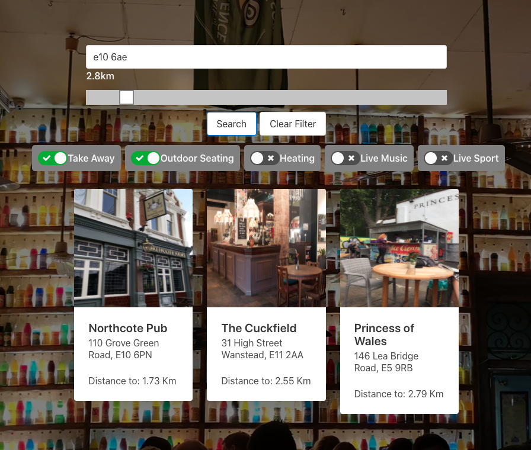

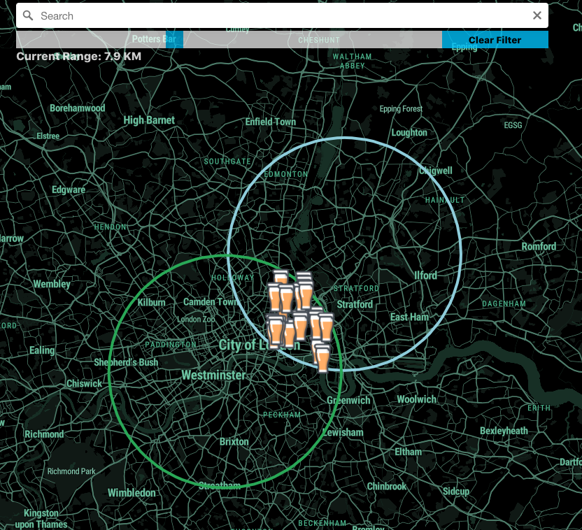
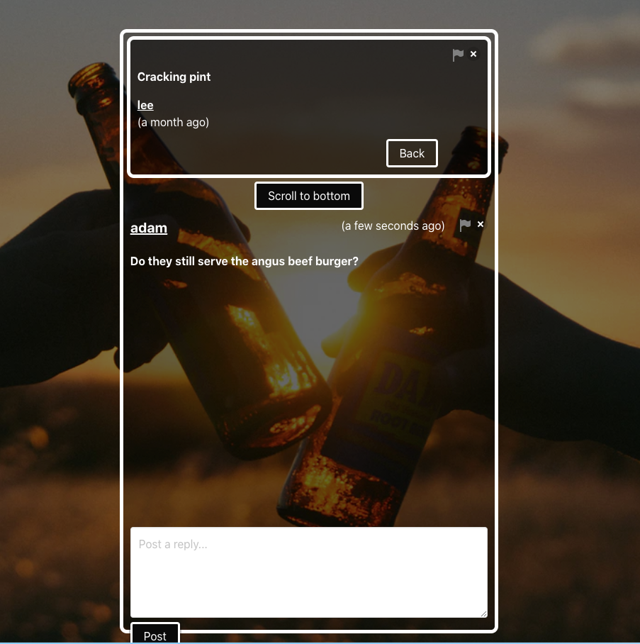

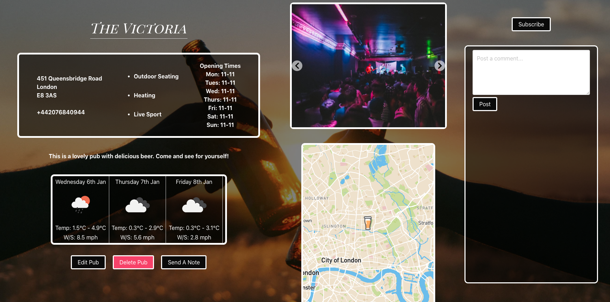
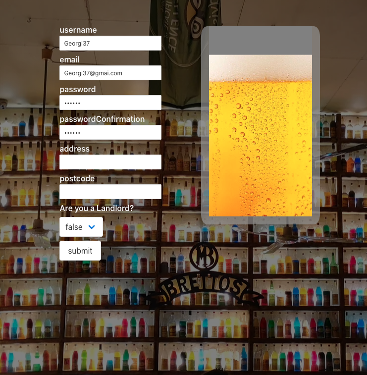
